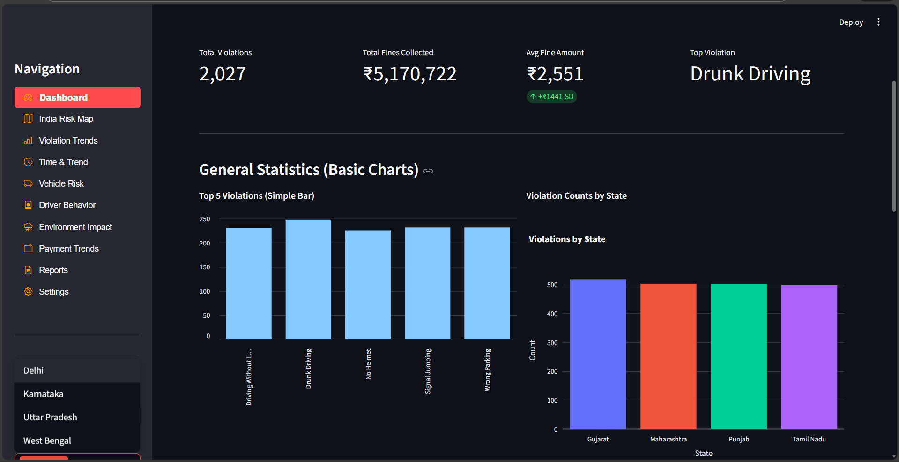

# 🚦 Smart Traffic Violation Pattern Detector

A sophisticated Streamlit application designed to analyze Indian traffic violation data, identifying patterns, risk hotspots, and driver behaviors to inform policy and enforcement.

## 🌟 Key Features

### 1. **Interactive Dashboard**
A futuristic control center featuring a high-level overview of traffic statistics, financial impact, and real-time trend analysis. Includes a clear summary of total violations, fines collected, and top offenses.

### 2. **India Risk Map Analysis**
Geospatial visualization of violation hotspots across Indian states.
- **Folium Integration**: Interactive map with marker clusters.
- **Plotly Mapbox**: Heatmap interactions for deep dives.

### 3. **Deep Trend Analytics**
- **Violation Trends**: Sunburst charts and scatter plots to correlate vehicle types with violations.
- **Time Analysis**: Stacked area charts and polar clock views to identify peak violation hours.
- **Driver Behavior**: Violin plots analyzing age and gender demographics.

### 4. **Financial Insights**
- Cumulative revenue tracking to see the financial progression of fine collections.
- Payment status breakdown (Paid vs Unpaid).

## 🚀 How to Run

1. **Install Dependencies**:
   ```bash
   pip install -r requirements.txt
   ```

2. **Launch the App**:
   ```bash
   streamlit run main.py
   ```

## 📸 Feature Previews



*Dashboard Overview showing Key Metrics and Real-time Trends.*
